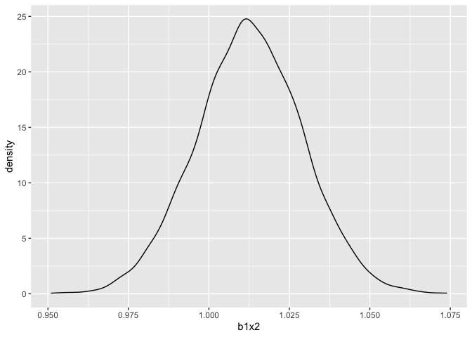
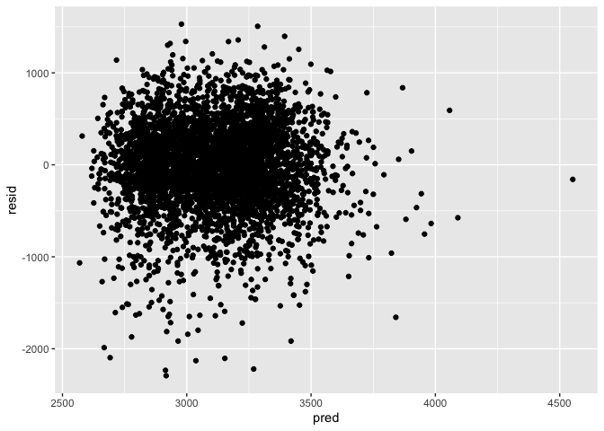
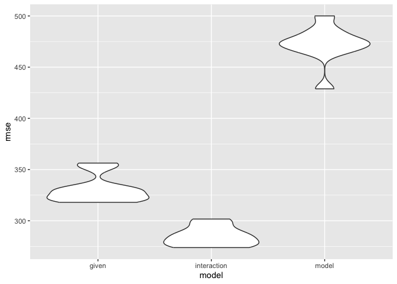

p8105_hw6_eb3516
================
Liz Bekerman
2023-12-02

``` r
options(
  ggplot2.continuous.colour="viridis",
  ggplot2.continuous.fill="viridis")

scale_colour_discrete=scale_colour_viridis_d
scale_fill_discrete=scale_fill_viridis_d
```

## Problem 2

First, we import the weather data.

``` r
weather_df=
  rnoaa::meteo_pull_monitors(
    c("USW00094728"),
    var=c("PRCP", "TMIN", "TMAX"),
    date_min="2022-01-01",
    date_max="2022-12-31") |>
  mutate(
    name=recode(id, USW00094728="CentralPark_NY"),
    tmin=tmin/10,
    tmax=tmax/10) |>
  select(name, id, everything())
```

    ## using cached file: /Users/lizbekerman/Library/Caches/org.R-project.R/R/rnoaa/noaa_ghcnd/USW00094728.dly

    ## date created (size, mb): 2023-12-02 11:00:44.015667 (8.544)

    ## file min/max dates: 1869-01-01 / 2023-11-30

The linear model predicts `tmax` using `tmin` and `prcp`.

Next, we will run 5000 bootstraps to estimate R-squared and log(B1\*B2).

``` r
weather_bootstrap = weather_df |>
  bootstrap(n=5000) |>
  mutate(
    models=map(strap, \(weather_df) lm(tmax~tmin+prcp, weather_df)),
    results=map(models, broom::tidy),
    rsq=map(models, broom::glance)
  ) |>
  select(-strap, -models) |>
  unnest(results) |>
  filter(term %in% c("tmin", "prcp")) |>
  group_by(.id) |>
  mutate(B1x2=sum(estimate)) |>
  select(B1x2, rsq) |>
  unnest(rsq) |>
  janitor::clean_names() |>
  select(id, b1x2, r_squared) |> unique()
```

    ## Adding missing grouping variables: `.id`

Next, we’ll calculate the confidence intervals.

``` r
weather_bootstrap |>
  summarize(
    rsq_lower_ci=quantile(r_squared, 0.025),
    rsq_upper_ci=quantile(r_squared, 0.975)
  )
```

    ## # A tibble: 5,000 × 3
    ##    id    rsq_lower_ci rsq_upper_ci
    ##    <chr>        <dbl>        <dbl>
    ##  1 0001         0.910        0.910
    ##  2 0002         0.908        0.908
    ##  3 0003         0.927        0.927
    ##  4 0004         0.911        0.911
    ##  5 0005         0.903        0.903
    ##  6 0006         0.925        0.925
    ##  7 0007         0.931        0.931
    ##  8 0008         0.919        0.919
    ##  9 0009         0.922        0.922
    ## 10 0010         0.932        0.932
    ## # ℹ 4,990 more rows

``` r
weather_bootstrap |>
  summarize(
    beta_lower_ci=quantile(b1x2, 0.025),
    beta_upper_ci=quantile(b1x2, 0.975)
  )
```

    ## # A tibble: 5,000 × 3
    ##    id    beta_lower_ci beta_upper_ci
    ##    <chr>         <dbl>         <dbl>
    ##  1 0001          1.03          1.03 
    ##  2 0002          1.01          1.01 
    ##  3 0003          1.03          1.03 
    ##  4 0004          0.986         0.986
    ##  5 0005          1.01          1.01 
    ##  6 0006          1.04          1.04 
    ##  7 0007          1.02          1.02 
    ##  8 0008          1.00          1.00 
    ##  9 0009          1.02          1.02 
    ## 10 0010          1.02          1.02 
    ## # ℹ 4,990 more rows

Lastly, we’ll plot distributions.

``` r
weather_bootstrap |>
  ggplot(aes(x=b1x2)) + geom_density()
```

<!-- -->

``` r
weather_bootstrap |>
  ggplot(aes(x=r_squared)) + geom_density()
```

<!-- -->

## Problem 3

First, we import and tidy the birthweight data.

``` r
  birthweight_df=read_csv("birthweight.csv") |>
    mutate(babysex=as.factor(babysex),
           frace=as.factor(frace),
           malform=as.factor(malform),
           mrace=as.factor(mrace)) |>
          janitor::clean_names()
```

    ## Rows: 4342 Columns: 20
    ## ── Column specification ────────────────────────────────────────────────────────
    ## Delimiter: ","
    ## dbl (20): babysex, bhead, blength, bwt, delwt, fincome, frace, gaweeks, malf...
    ## 
    ## ℹ Use `spec()` to retrieve the full column specification for this data.
    ## ℹ Specify the column types or set `show_col_types = FALSE` to quiet this message.

My proposed regression model for birthweight will use `babysex`,
`mrace`, `delwt`, and `momage`.

Show plot of model against fitted values:

``` r
model=lm(bwt~babysex + mrace + delwt + momage, data=birthweight_df)

birthweight_df |>
  modelr::add_residuals(model) |>
  modelr::add_predictions(model) |>
  ggplot(aes(x=pred, y=resid))+geom_point()
```

<!-- -->

Now, I’ll compare my model to the 2 other models using cross-validation:

``` r
cross_val = crossv_mc(birthweight_df, 10)

cross_val=cross_val |>
  mutate(train=map(train, as_tibble),
         test=map(test, as_tibble))

cross_val=cross_val |>
  mutate(
    model=map(train, \(birthweight_df) lm(bwt~babysex + mrace + delwt + momage, data=birthweight_df)),
    given_model=map(train, \(birthweight_df) lm(bwt~blength+gaweeks, data=birthweight_df)),
    interaction_model=map(train, \(birthweight_df) lm(bwt~bhead*blength*babysex, data=birthweight_df))
  ) |>
  mutate(
    rmse_model=map2_dbl(model, test, \(mod, birthweight_df) rmse(model=mod, data=birthweight_df)),
    rmse_given=map2_dbl(given_model, test, \(mod, birthweight_df) rmse(model=mod, data=birthweight_df)),
    rmse_interaction=map2_dbl(interaction_model, test, \(mod, birthweight_df) rmse(model=mod, data=birthweight_df))
  )

cross_val |>
  select(starts_with("rmse")) |>
  pivot_longer(
    everything(), names_to="model", values_to="rmse", names_prefix="rmse_"
  ) |>
  ggplot(aes(x=model, y=rmse)) + geom_violin()
```

<!-- -->
Based on RMSE, the model using head circumference, length, sex, and the
interactions is
